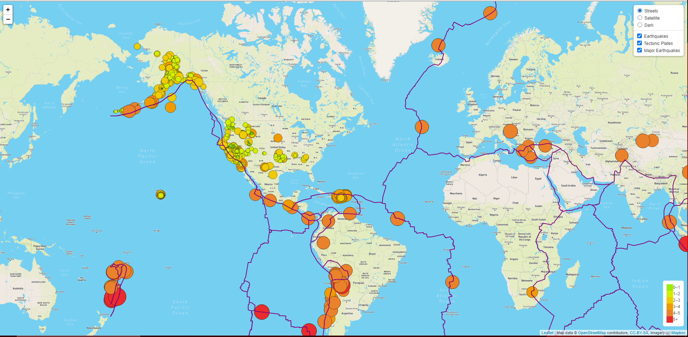

# Mapping_Earthquakes

Purpose of this project is to create a map using HTML, JavaScript and CSS that displays various data of Earthquakes around the globe. The map is fully interactable with toggleable map layers and the ability to click on each symbol on the map for the location of each earthquake. The size and color of the circles are dependent on how large the earthquake was.

## Full Map

To see full interactive map please git clone the repository and open the HTML file under the Earthquake Challenge directory on your local machine.
